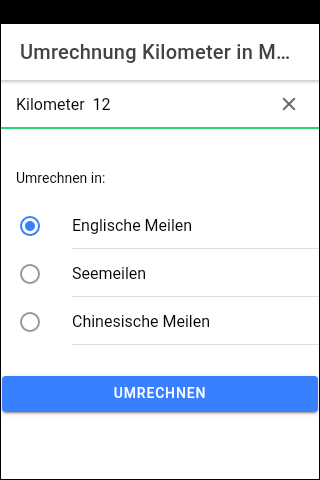
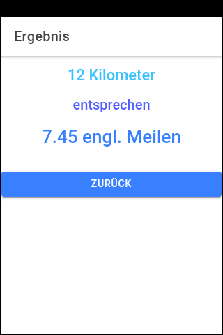

# Ionic-App "Kilometer-Umrechung" #

Simple app with [Ionic 5](https://ionicframework.com) to convert a value in Kilometers into different types of miles.

<br>

For a variant of this app as native app see [this repository](https://github.com/MDecker-MobileComputing/Android_KilometerUmrechnung).

<br>

----
## Screenshots ##

  


<br>

----
## Build Android app ##

Prerequisite: [Apache Cordova](https://cordova.apache.org/) must be installed & configured. 

Enter the following command in the root folder of the project:
````
ionic cordova build android
````

<br>

----
## License ##

See the [LICENSE file](LICENSE.md) for license rights and limitations (BSD 3-Clause License)
for the files in this repository.
