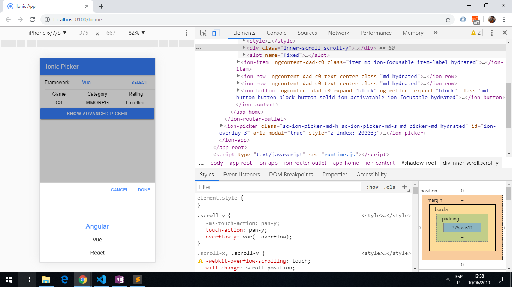
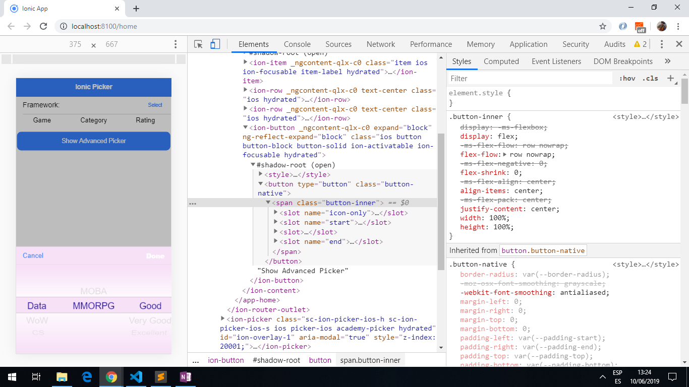

# Ionic Picker Study

App created using the [Ionic 5 framework](https://ionicframework.com/docs) to use the [Ion-picker](https://ionicframework.com/docs/api/picker) component. Great tutorial from [Ionic Academy](https://ionicacademy.com/how-to-ion-picker-component/)

## Table of contents

* [General info](#general-info)
* [Screenshots](#screenshots)
* [Technologies](#technologies)
* [Setup](#setup)
* [Features](#features)
* [Status](#status)
* [Inspiration](#inspiration)
* [Contact](#contact)

## General info

* Extract from the [Ion-picker](https://ionicframework.com/docs/api/picker) documentation: A Picker is a dialog that displays a row of buttons and columns underneath. It appears on top of the app's content, and at the bottom of the viewport.

* No extra imported dependencies; picker controller component is part of ionic/angular, picker options component is part of ionic/core. Note: picker buttons components was not used.

## Screenshots




## Technologies

* [Ionic v5.7.0](https://ionicframework.com/)

* [Angular v7.2.2](https://angular.io/)

* [Ionic/angular v4.1.0](https://www.npmjs.com/package/@ionic/angular)

## Setup

* To start the server on _localhost://8100_ type: 'ionic serve'

## Code Examples

* extract from `picker.interface.ts` file (reached by right-clicking on '_PickerOptions_' in `home.page.ts` and choosing '_go to definition_'). Shows how to fill in Picker Column options.

```typescript
export interface PickerOptions {
    columns: PickerColumn[];
    buttons?: PickerButton[];
    cssClass?: string | string[];
    backdropDismiss?: boolean;
    animated?: boolean;
    mode?: Mode;
    keyboardClose?: boolean;
    id?: string;
    enterAnimation?: AnimationBuilder;
    leaveAnimation?: AnimationBuilder;
}
```

## Features

* single and multi-column pickers available.

## Status & To-do list

* Status: Working.

* To-do: try more of the functionality from the Ion-picker component.

## Inspiration

Project inspired by [Simon Grimm´s Youtube video: How to Present a Picker Using the Ion Picker Component](https://www.youtube.com/watch?v=bEjw--B8jS0)

## Contact

Repo created by [ABateman](https://www.andrewbateman.org) - feel free to contact me!
